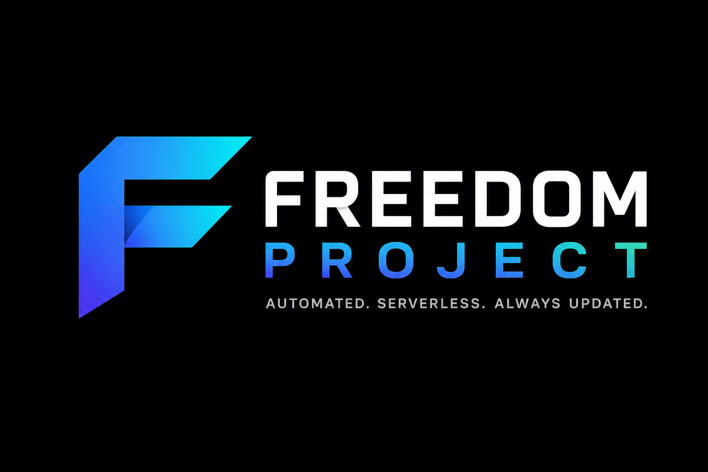
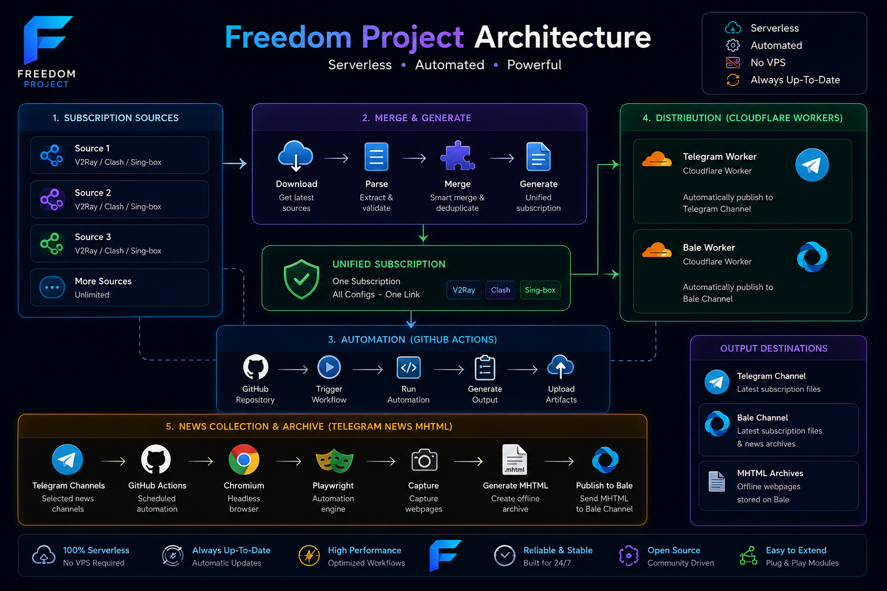

<p align="center">
  
</p>

<h1 align="center">🚀 Freedom Project</h1>

<p align="center">

The Ultimate Serverless Ecosystem for Subscription Aggregation, Cloudflare Automation, News Collection and Multi-Platform Distribution.

</p>

<p align="center">

Merge • Publish • Archive • Automate

</p>

<p align="center">


</p>

---

# 🌍 About

Freedom Project is a complete automation ecosystem built to simplify the process of collecting, generating and distributing Subscription files while also archiving important news automatically.

Instead of being just another Subscription repository, Freedom Project combines multiple independent automation systems into one unified platform.

Everything runs automatically.

No VPS.

No dedicated server.

No manual work.

---

# 🚀 Core Components

## 📦 Subscription Aggregator

Freedom Project continuously collects Subscription sources and merges them into one clean Subscription.

Supported formats include:

- V2Ray
- Clash
- Sing-box
- Base64 Subscription

---

## ☁ Cloudflare Workers

Dedicated Workers automatically download the latest generated Subscription and distribute it across multiple platforms.

Current Workers:

- Telegram Publisher
- Bale Publisher

Workers run completely serverless.

---

## 📡 Automatic Distribution

Whenever GitHub generates a new Subscription...

Cloudflare Workers automatically download it and publish it.

Platforms:

- Telegram
- Bale

Users always receive the newest Subscription.

---

## 📰 Telegram News System

Freedom Project also includes a dedicated News Collection project.

It monitors selected Telegram news channels, captures webpages using Chromium and Playwright and generates offline MHTML archives.

This project is maintained separately.

Repository:

https://github.com/amyrmhdyfrhzady/telegram-news-mhtml

---

# 🔥 Features

- Merge multiple Subscription sources
- Automatic Subscription generation
- Cloudflare Workers
- Telegram Publisher
- Bale Publisher
- GitHub Actions Automation
- Telegram News Collector
- Website Archiver
- MHTML Generator
- Serverless Infrastructure
- No VPS Required
- Fully Automated
- Easy to Extend
- Open Source

---

<p align="center">


</p>

---

# 🏗 Architecture

```text
                 Subscription Sources
                         │
                         ▼
                Merge Configurations
                         │
                         ▼
               Unified Subscription
                         │
          ┌──────────────┴──────────────┐
          ▼                             ▼
 Cloudflare Telegram Worker      Cloudflare Bale Worker
          │                             │
          ▼                             ▼
   Telegram Channel              Bale Channel


──────────────────────────────────────────────────────────


 Selected Telegram News Channels
                │
                ▼
         GitHub Actions
                │
                ▼
      Chromium + Playwright
                │
                ▼
        Generate MHTML
                │
                ▼
         Publish to Bale
```

---

# 📸 Preview

<p align="center">

</p>

---
# ⚙️ Automation Workflow

```text
                      GitHub Actions
                             │
                             ▼
                 Download Subscription Sources
                             │
                             ▼
                    Merge Configurations
                             │
                             ▼
                 Generate Final Subscription
                             │
            ┌────────────────┴────────────────┐
            ▼                                 ▼
 Cloudflare Telegram Worker         Cloudflare Bale Worker
            │                                 │
            ▼                                 ▼
     Telegram Channel                 Bale Channel


────────────────────────────────────────────────────────────


 Selected Telegram Channels
            │
            ▼
      Telegram News Project
            │
            ▼
 Chromium + Playwright
            │
            ▼
      Capture Webpage
            │
            ▼
      Generate MHTML
            │
            ▼
        Send to Bale
```

---

# 📂 Project Structure

```text
.
├── .github
│   └── workflows
│
├── workers
│   ├── telegram-worker.js
│   └── bale-worker.js
│
├── src
│   ├── merge.js
│   ├── parser.js
│   ├── config.js
│   └── utils.js
│
├── subscriptions
│
├── assets
│   ├── banner.png
│   ├── architecture.png
│   ├── workflow.png
│   ├── preview.png
│   └── logo.png
│
├── README.md
└── package.json
```

---

# ⚡ Technologies

Freedom Project is powered by modern cloud technologies.

| Technology | Purpose |
|------------|---------|
| GitHub Actions | Automation |
| Cloudflare Workers | Distribution |
| GitHub Raw | File Hosting |
| Node.js | Runtime |
| Playwright | Browser Automation |
| Chromium | Website Capture |
| Telegram Bot API | Telegram Distribution |
| Bale Bot API | Bale Distribution |

---

# 📡 Official Channels

## Telegram

Latest Subscription Files

https://t.me/+R3IrPpe8sVY1OTg0

---

## Bale

Latest Subscription Files

https://ble.ir/join/AR6YgWwcpU

---

# 📚 Related Projects

## 📰 Telegram News MHTML

Freedom Project also includes an independent project dedicated to automatically archiving Telegram news websites into offline MHTML files.

Repository

https://github.com/amyrmhdyfrhzady/telegram-news-mhtml

Features

- Chromium
- Playwright
- GitHub Actions
- Automatic MHTML Generation
- Automatic Bale Publishing

---

# 🌟 Why Freedom Project?

Unlike ordinary Subscription repositories...

Freedom Project is an ecosystem.

It automatically

- Collects
- Merges
- Generates
- Downloads
- Publishes
- Archives
- Synchronizes

Everything works together.

---

# 📊 Project Highlights

| Feature | Status |
|----------|--------|
| Subscription Merge | ✅ |
| Cloudflare Workers | ✅ |
| Telegram Distribution | ✅ |
| Bale Distribution | ✅ |
| GitHub Actions | ✅ |
| News Collection | ✅ |
| MHTML Archive | ✅ |
| Serverless | ✅ |
| No VPS | ✅ |
| Automatic Updates | ✅ |
| Open Source | ✅ |

---

<p align="center">



</p>

---
# 📜 Version History

## v1.0.0
- Initial release.
- Added subscription (Sub) link generation.

---

## v1.1.0
- Added separate configuration files for administrators to manage subscription sources.

## v1.1.1
- Fixed configuration import order issues.

---

## v1.2.1
- Added support for external subscription links.

## v1.2.2
- Fixed various reported bugs and improved overall stability.

---

## v1.3.3
- Added GitHub Actions cron job for automatic project updates and subscription regeneration.
- Fixed cron job related issues.

## v1.3.5
- Reorganized the project structure.
- Cleaned up source files.
- Fixed additional reported bugs.

---

## v2.3.5
- Launched the official Telegram channel.
- Added an automated Telegram bot for downloading and publishing subscription files.

## v2.4.5
- Added automatic Telegram delivery using GitHub Actions.
- Subscription files are now generated, downloaded, and published automatically after every update.

---

# 🚀 Big Update

## v3.4.5
- Launched the official Bale channel.
- Developed a fully automated Bale bot for subscription delivery.
- This update ensures users can still receive configuration files during complete internet disruptions.

## v3.5.6
- Added usage instructions to all generated files.
- Improved project reliability and fixed numerous bugs.

---

# 🚀 Massive Update

## v4.5.6
- Added the News Archive system.
- Developed an automated crawler that captures trusted news sources as **MHTML** archives.
- News pages from trusted references such as **Vahid Online**, **Iran International**, and other verified sources are automatically archived and published to the **FREEDOMPROJECT** Bale channel.
- This feature preserves news pages exactly as they originally appeared.

## v4.5.7
- Corrected Telegram message timestamps inside archived MHTML files.
- Improved localization and timezone handling.

## v4.6.7
- Updated the automation workflow for more reliable scheduled delivery.

## v4.7.7
- Expanded and refreshed the list of trusted news sources.

---

# 🎉 Final Release

## v5.8.7
- Final development milestone of **FREEDOMPROJECT**.
- Performance improvements.
- Code cleanup and optimization.
- Numerous bug fixes and stability enhancements.
- Long-term maintenance release.

---

## v5.8.8
- Update README.md File.

---
# 🗺 Roadmap

The Freedom Project is actively evolving. Planned improvements include:

- [x] Subscription Aggregator
- [x] GitHub Actions Automation
- [x] Cloudflare Workers
- [x] Telegram Publisher
- [x] Bale Publisher
- [x] Telegram News Collector
- [x] Website MHTML Archiver
- [ ] Multi-language Support
- [ ] Web Dashboard
- [ ] Public REST API
- [ ] Subscription Statistics
- [ ] Web Interface
- [ ] Health Monitoring
- [ ] Automatic Source Validation
- [ ] Duplicate Detection Improvements
- [ ] Performance Optimizations

---

# 📈 Project Goals

Freedom Project aims to provide a completely automated and serverless platform for:

- Subscription aggregation
- Configuration distribution
- Website archiving
- News collection
- Multi-platform publishing

The long-term goal is to build a reliable ecosystem that requires minimal maintenance while remaining easy to extend.

---

# 🤝 Contributing

Contributions are always welcome.

If you would like to improve this project:

1. Fork the repository
2. Create a new branch
3. Commit your changes
4. Open a Pull Request

Bug reports, feature requests and suggestions are greatly appreciated.

---

# ❤️ Support

If you find this project useful, please consider:

- ⭐ Starring the repository
- 🍴 Forking the project
- 🛠 Contributing improvements
- 📢 Sharing it with others

Every contribution helps the project grow.

---

# 📜 License

This project is released under the **MIT License**.

See the `LICENSE` file for more information.

---

# 👨‍💻 Author

Developed and maintained by **amyrmhdyfrhzady**.

GitHub:

https://github.com/amyrmhdyfrhzady

---

# 🙏 Acknowledgements

Special thanks to the developers and communities behind:

- Cloudflare Workers
- GitHub Actions
- Node.js
- Playwright
- Chromium
- Telegram Bot API
- Bale Bot API

Their tools make this project possible.

---

# 🌐 Ecosystem

Freedom Project consists of multiple components working together:

```text
                Freedom Project
                       │
     ┌─────────────────┼─────────────────┐
     │                 │                 │
     ▼                 ▼                 ▼
Subscription      Cloudflare       News Collector
 Aggregator         Workers          (MHTML)

     │                 │                 │
     ▼                 ▼                 ▼
 Telegram          Telegram         GitHub Actions
 Bale              Bale             Playwright

```

---

# 📌 Repository Overview

| Component | Description |
|-----------|-------------|
| Subscription Aggregator | Merge multiple subscription sources |
| Cloudflare Workers | Automatic Telegram & Bale publishing |
| GitHub Actions | Automated workflows |
| Telegram News MHTML | Website archiving project |
| Serverless Infrastructure | No VPS required |

---

<p align="center">


</p>

<h2 align="center">

Freedom Project

</h2>

<p align="center">

A modern serverless ecosystem for Subscription aggregation, automated publishing and news archiving.

</p>

<p align="center">

Made with ❤️ using

GitHub Actions • Cloudflare Workers • Node.js • Playwright • Telegram Bot API • Bale Bot API

</p>
